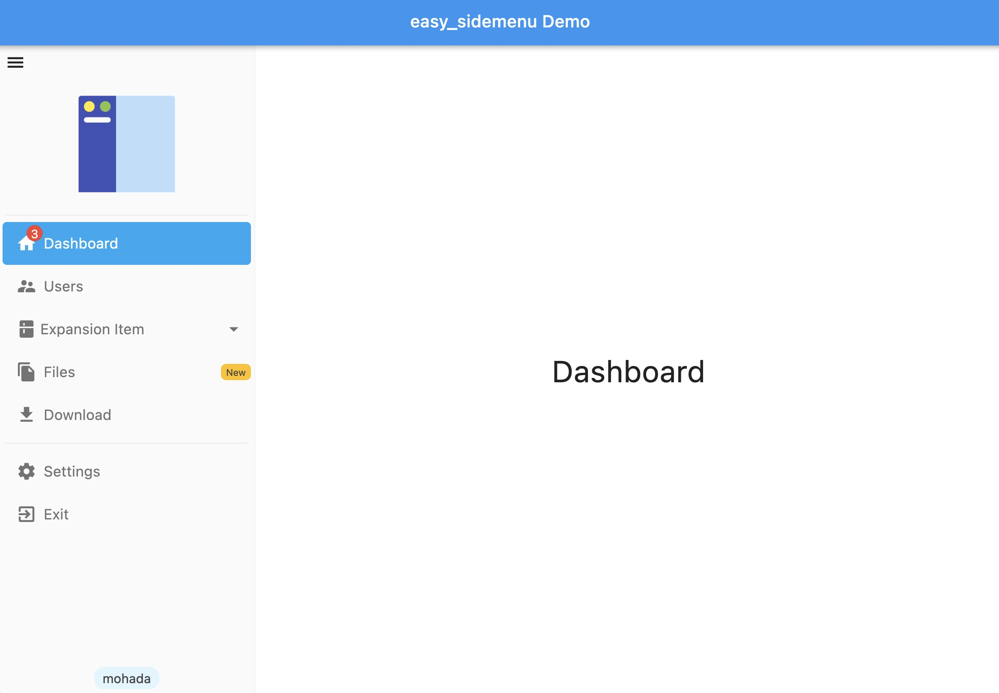
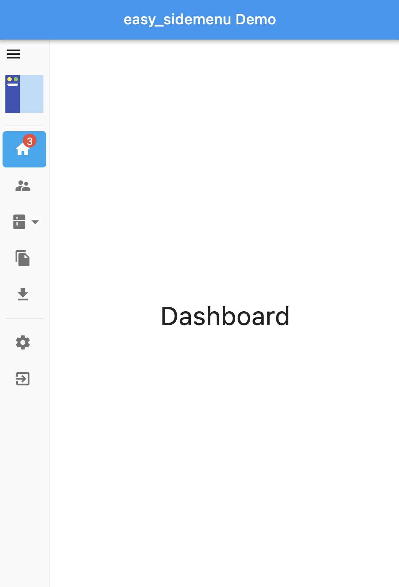
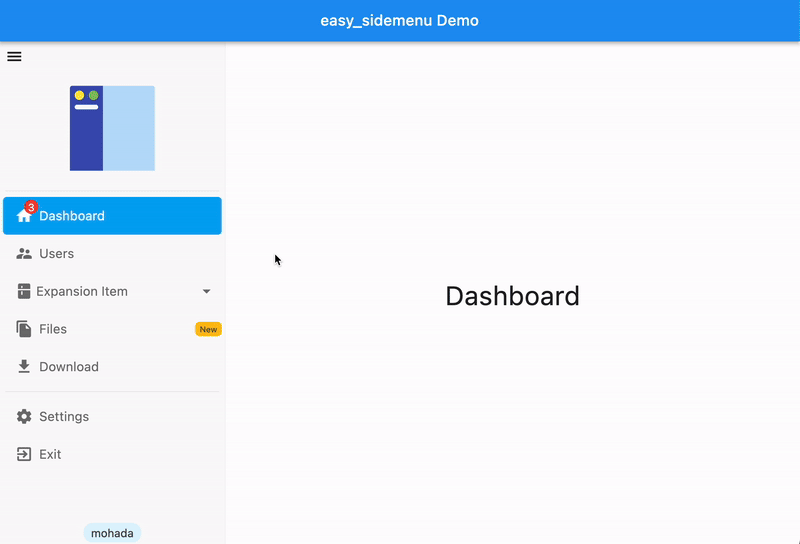

<h1 align="center">Easy Sidemenu</h1>

 

Easy sidemenu is An easy to use side menu (bar) for flutter that you can use for navigation in your application.

Sidemenu is a menu that is usually located on the left or right of the page and can used for navigation or other things.
Sidemenu is similar to bottom navigation bar but in the side of screen and usually used for larger screens.

## Screenshots

| Open                             | Compact                             |
| -------------------------------- | ----------------------------------- |
|  |  |

| Auto                              |
| --------------------------------- |
|  |

## Demo

You can see web demo here: [https://jamalianpour.github.io/easy_sidemenu](https://jamalianpour.github.io/easy_sidemenu)

## Usage

##### 1. add dependencies into you project pubspec.yaml file
